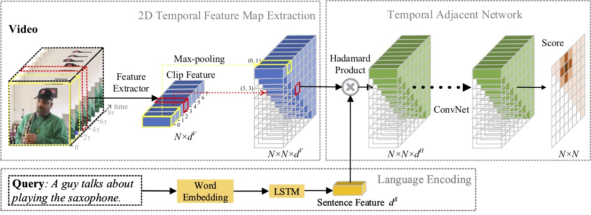

# 2D-TAN

we are hiring talented interns: houwen.peng@microsoft.com

In  this  paper,  we  study  the  problem  of  moment  localization  with  natural  language,  and  propose  a  novel  2D  Temporal Adjacent Networks(2D-TAN) method. 
The core idea is to retrieve a moment on a two-dimensional temporal map, which considers adjacent moment candidates as the temporal context. 
2D-TAN is capable of encoding adjacent temporal relation, while learning discriminative feature for matching video moments with referring expressions. 
Our model is  simple  in  design  and  achieves  competitive  performance in  comparison  with  the  state-of-the-art  methods  on  three benchmark datasets.

[Arxiv Preprint](https://arxiv.org/abs/1912.03590)

**Please check the [`ms-2d-tan`](https://github.com/microsoft/2D-TAN/tree/ms-2d-tan) branch for our [TPAMI extension](https://arxiv.org/abs/2012.02646).**

## News
- :beers: Our journal extension is accepted by TPAMI.
- :wrench: A third-party [optimized implementation](https://github.com/ChenJoya/2dtan) by @ChenJoya.
- :sunny: Our paper was accepted by AAAI-2020. [Arxiv Preprint](https://arxiv.org/abs/1912.03590)
- :trophy: We extend our 2D-TAN approach to the temporal action localization task and win the **1st** place in [HACS Temporal Action Localization Challenge](http://hacs.csail.mit.edu/challenge.html) at [ICCV 2019](iccv2019.thecvf.com). For more details please refer to our [technical report](https://arxiv.org/abs/1912.03612).

## Framework


## Main Results

#### Main results on Charades-STA
| Method | Rank1@0.5 | Rank1@0.7 | Rank5@0.5 | Rank5@0.7 |
| ---- |:-------------:| :-----:|:-----:|:-----:|
| Pool | 40.94 | 22.85 | 83.84 | 50.35 |
| Conv | 42.80 | 23.25 | 80.54 | 54.14 |

I fixed a bug for loading charades visual features, the updated performance is listed above.
Please use these results when comparing with our AAAI paper. 

#### Main results on ActivityNet Captions 
| Method | Rank1@0.3 | Rank1@0.5 | Rank1@0.7 | Rank5@0.3 | Rank5@0.5 | Rank5@0.7 |
| ---- |:-------------:| :-----:|:-----:|:-----:|:-----:|:-----:|
| Pool | 59.45 | 44.51 | 26.54 | 85.53 | 77.13 | 61.96 |
| Conv | 58.75 | 44.05 | 27.38 | 85.65 | 76.65 | 62.26 |

#### Main results on TACoS
| Method | Rank1@0.1 | Rank1@0.3 | Rank1@0.5 | Rank5@0.1 | Rank5@0.3 | Rank5@0.5 |
| ---- |:-------------:| :-----:|:-----:|:-----:|:-----:|:-----:|
| Pool | 47.59 | 37.29 | 25.32 | 70.31 | 57.81 | 45.04 |
| Conv | 46.39 | 35.17 | 25.17 | 74.46 | 56.99 | 44.24 |

## Prerequisites
- pytorch 1.1.0
- python 3.7
- torchtext
- easydict
- terminaltables


## Quick Start

Please download the visual features from [box](https://rochester.box.com/s/8znalh6y5e82oml2lr7to8s6ntab6mav) or [dropbox](https://www.dropbox.com/sh/dszrtb85nua2jqe/AABGAEQhPtqBIRpGPY3gZey6a?dl=0) and save it to the `data/` folder. 


#### Training
Use the following commands for training:
```
# Evaluate "Pool" in Table 1
python moment_localization/train.py --cfg experiments/charades/2D-TAN-16x16-K5L8-pool.yaml --verbose
# Evaluate "Conv" in Table 1
python moment_localization/train.py --cfg experiments/charades/2D-TAN-16x16-K5L8-conv.yaml --verbose

# Evaluate "Pool" in Table 2
python moment_localization/train.py --cfg experiments/activitynet/2D-TAN-64x64-K9L4-pool.yaml --verbose
# Evaluate "Conv" in Table 2
python moment_localization/train.py --cfg experiments/activitynet/2D-TAN-64x64-K9L4-conv.yaml --verbose

# Evaluate "Pool" in Table 3
python moment_localization/train.py --cfg experiments/tacos/2D-TAN-128x128-K5L8-pool.yaml --verbose
# Evaluate "Conv" in Table 3
python moment_localization/train.py --cfg experiments/tacos/2D-TAN-128x128-K5L8-conv.yaml --verbose
```

#### Testing
Our trained model are provided in [box](https://rochester.box.com/s/5cfp7a5snvl9uky30bu7mn1cb381w91v) or [dropbox](https://www.dropbox.com/sh/27i8wvwk9cw521f/AAA4FJVDFVQZSjBoWC2x8NAIa?dl=0). Please download them to the `checkpoints` folder.

Then, run the following commands for evaluation: 
```
# Evaluate "Pool" in Table 1
python moment_localization/test.py --cfg experiments/charades/2D-TAN-16x16-K5L8-pool.yaml --verbose --split test
# Evaluate "Conv" in Table 1
python moment_localization/test.py --cfg experiments/charades/2D-TAN-16x16-K5L8-conv.yaml --verbose --split test

# Evaluate "Pool" in Table 2
python moment_localization/test.py --cfg experiments/activitynet/2D-TAN-64x64-K9L4-pool.yaml --verbose --split test
# Evaluate "Conv" in Table 2
python moment_localization/test.py --cfg experiments/activitynet/2D-TAN-64x64-K9L4-conv.yaml --verbose --split test

# Evaluate "Pool" in Table 3
python moment_localization/test.py --cfg experiments/tacos/2D-TAN-128x128-K5L8-pool.yaml --verbose --split test
# Evaluate "Conv" in Table 3
python moment_localization/test.py --cfg experiments/tacos/2D-TAN-128x128-K5L8-conv.yaml --verbose --split test
```

## Citation
If any part of our paper and code is helpful to your work, please generously cite with:
```
@InProceedings{2DTAN_2020_AAAI,
author = {Zhang, Songyang and Peng, Houwen and Fu, Jianlong and Luo, Jiebo},
title = {Learning 2D Temporal Adjacent Networks forMoment Localization with Natural Language},
booktitle = {AAAI},
year = {2020}
} 
```
